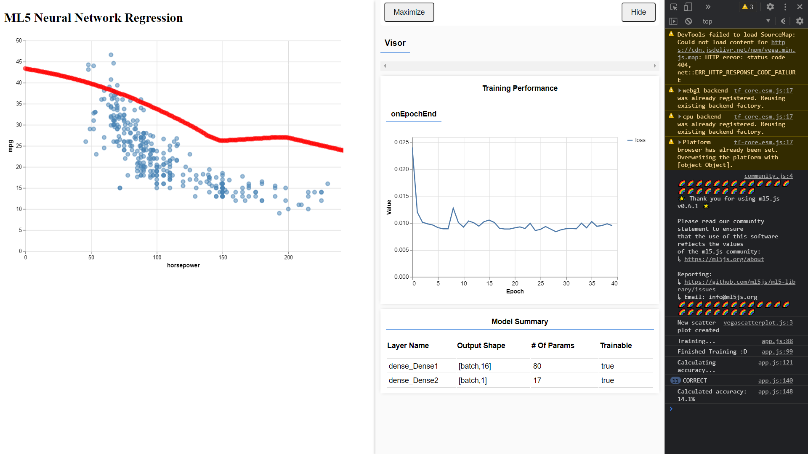

# Week 5

## Neural Networks I
- Welke data heb je gebruikt?
Ik heb de car data gebruikt. 

- Ging dat in een keer goed? Waar liep je tegen aan?

Het ging best goed. Ik heb de startopdracht en de [documentatie van ML5 Neural Networks](https://learn.ml5js.org/#/reference/neural-network) gevolgd, maar met echte data ipv fake data. Dit ging goed.

Toen ik die af had ging ik door met de inleveropdracht. Toen heb ik als eerst de data opgeschoond en gesplit daarna de accuracy uitgerekend. De code voor de accuracy heb ik deels kunnen hergebruiken van de vorige opdracht. Dit ging ook best soepel, maar de accuracy kwam niet boven de 10% uit. 

Daarom probeerde ik de accuracy te verbeteren door andere data, zoals acceleration, weight e.d. van de auto's toe te voegen. Dit werkte wel en de accuracy lag nu wat boven de 10%, maar mij lukte het niet om te zorgen dat de lijn in de plot ook goed bleef.

Dat komt omdat ik daar gewoon een for-loop gebruik om de horsepower te bepalen, maar omdat ik nu die andere data gebruikte moest ik die ook toevoegen, anders tekende hij de punten niet. Het probleem was dat ik niet wist waar ik die andere data hiervoor vandaan moest halen.

Daarom heb ik in de ingeleverde code gekozen om de goeie lijn in m'n data scatterplot te laten zien ipv de 'verbeterde' accuracy.

Om de gebruiker predictions te laten maken heb ik een text input en een button gemaakt. Als het Model nog aan het laden is staat er bij beide "Loading...". Zodra deze is geladen kunnen ze gebruikt worden. Voer het aantal horsepower in in het tekstveld en dan klik je op de "predict"-knop om de prediction te krijgen. Deze wordt gewoon in de HTML getoond.

- Is je prediction een mooie lijn in je data scatterplot?
- 
Jup, zie tekst hierboven voor meer info.

- Kon je een accuracy uitrekenen met testdata?
- 
Ja, deze wordt in de HTML en in de console weergegeven.

- Wat heb je gelezen van de geleverde externe links / filmpjes? Zat hier iets bij dat jij interessant vindt?
- 
Ik heb het artikel "A Beginners Guide to Neural Networks" gelezen. 
De verschillende types van Neural Networks vond ik interessant, want hier wist ik nog niet veel van. Het is best ingewikkeld en ik moest best wel een paar stukjes twee keer leren en zou het niet zo uit kunnen leggen, maar ik snap er wel wat meer en weet dat voor verschillende dingen je verschillende soorten Neural Networks het best kan gebruiken. Sowieso weten dat het er is is goed genoeg voor mij in dit geval. Als ik het nodig heb Google ik het wel weer.
